# 실제 작업 Repository
[이슈와 프로젝트, 위키에 작업했던 내용들이 있어요!](https://github.com/iclxxud/ios-wanted-VoiceRecorder)
# 빌드 방법
1. 프로젝트의 폴더에서 pod install
2. Target에서, Signing & Capabilities에서 Team 수정
3. 빌드

## 개발 환경
  - xcode : Version 13.4.1 (13F100)
  - deployment Target : 15.0
 
# 목차
  1. [Team](#Team)
     1. [팀원 소개](#팀원-소개)
     2. [기여한 부분](#기여한-부분)
  2. [프로젝트 소개](#프로젝트-소개)
     1. [목표](#목표)
     2. [사용한 기술](#사용한-기술)
     3. [기능 소개](#기능-소개)
        - [App Flow](#App-Flow)
        - [Demo gif](#Demo-gif)
     4. [사용한 Pattern 소개](#사용한-Pattern-소개)
        - [Coordinator Pattern](#Coordinator-Pattern)
        - [Observer Pattern](#Observer-Pattern)
        - [Delegate Pattern](#Delegate-Pattern)
     5. [객체 역할 소개](#객체-역할-소개)
        - [View 관련](#View-관련)
        - [Manger 관련](#Manger-관련)
     6. [Project UML](#Project-UML)
  3. [고민한 부분](#고민한-부분)
  4. [회고](회고)
  
---

# Team
## 팀원 소개 

| Downey                       | JMin                             |                            Oyat|
| ---------------------------- | -------------------------------- |----------------------------|
| | ||
|개발 및 팀 리딩, 기술 소개 | 개발 및 앱 Bug 탐색 | 개발 및 스터디 내용 자료 제작 |

## 기여한 부분

| 팀원 | 기여한 내용|
| ---------------------------- | -------------------------------- |
| Downey|- 팀 일정 및 작업 공수 조정  - 앱의 패턴 및 아키텍쳐 객체 구현 방법 리딩  - 코드 리팩토링 리드  - AudioManager 객체 역할 분리  - 의존 객체 전달 container 구현  - 의존관계에 dependency injection 구현  - pathfinder 객체 구현  - DefaultAudioPlayer 기능 구현  - VoiceMemoPlayerView 기능 구현  - VoiceMemoRecoderView UI 구현|
| JMin| - 로직 버그 픽스 및 리팩토링  - FirebaseManager 다운로드, 업로드, 삭제 기능 구현 - DefaultAudioRecorder 기능 구현 - VoiceMemoPlayerView UI구현 - VoiceMemoRecoderView 기능 구현 - waveFormView 구현 (Pair Programming) |
| Oyat| - VoiceMemoListView UI 구현  - VoiceMemoListView의 tableView dataSource, delegate 구현 - Coordinator Pattern 구현  - DefaultAudioPlayer의 Volume조절 기능 구현 - FirebaseStorageManager의 MetaData 주입 및 가져오기 기능 구현  - 녹음 완료 후 테이블뷰 리로드 notification 적용  - 셀 스와이프해서 삭제시 firebaseStorage, 로컬에서 파일 삭제 기능 구현  - waveFormView 구현 (Pair Programming)  - FirebaseStorageManager의 Singleton Pattern 제거  - FirebaseStorage의 녹음 파일에 재생 시간 메타데이터 주입 기능 구현|

# 프로젝트 소개

## 목표
> firebaseStorage와 연동하며, 재생 및 녹음 기능과 다수의 관련 부가기능을 제공하는 App    
> 외부 라이브러리 : __FirebaseStorage Only!__

## 사용한 기술
`Coordinator Pattern` `Observer Pattern` `Delegate Pattern`
`Code-based UI` `MVC` `Dependency inversion`
  
## 기능 소개

### App Flow
  - all Flow
  

  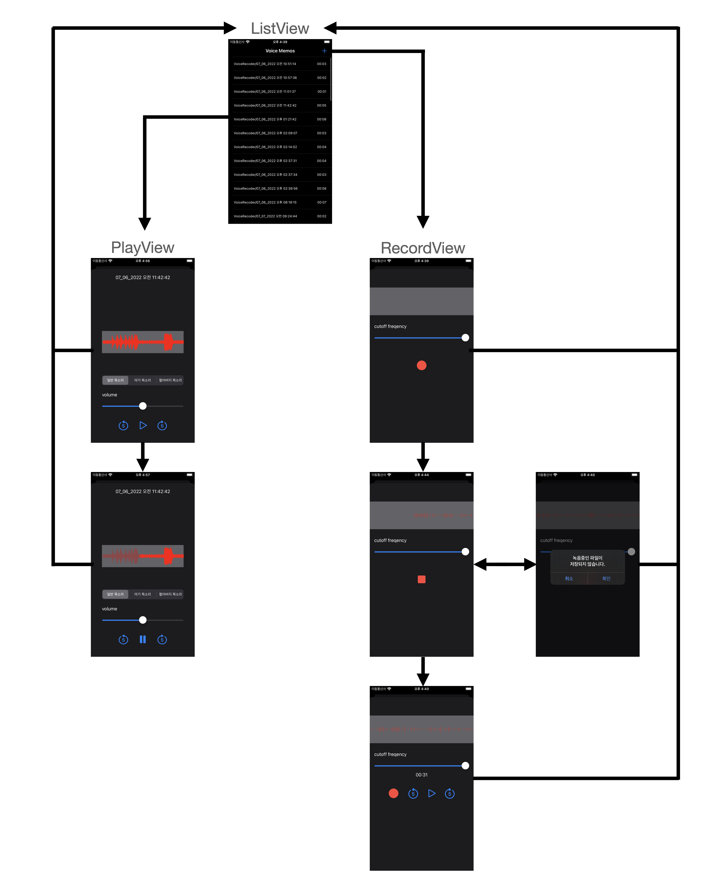
  

  - ListView Flow
  

  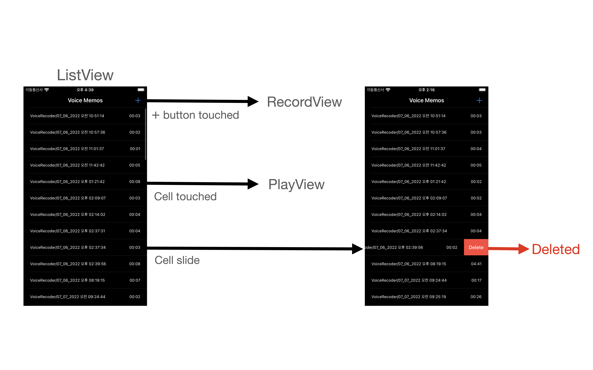
  

  - RecordView Flow
  

  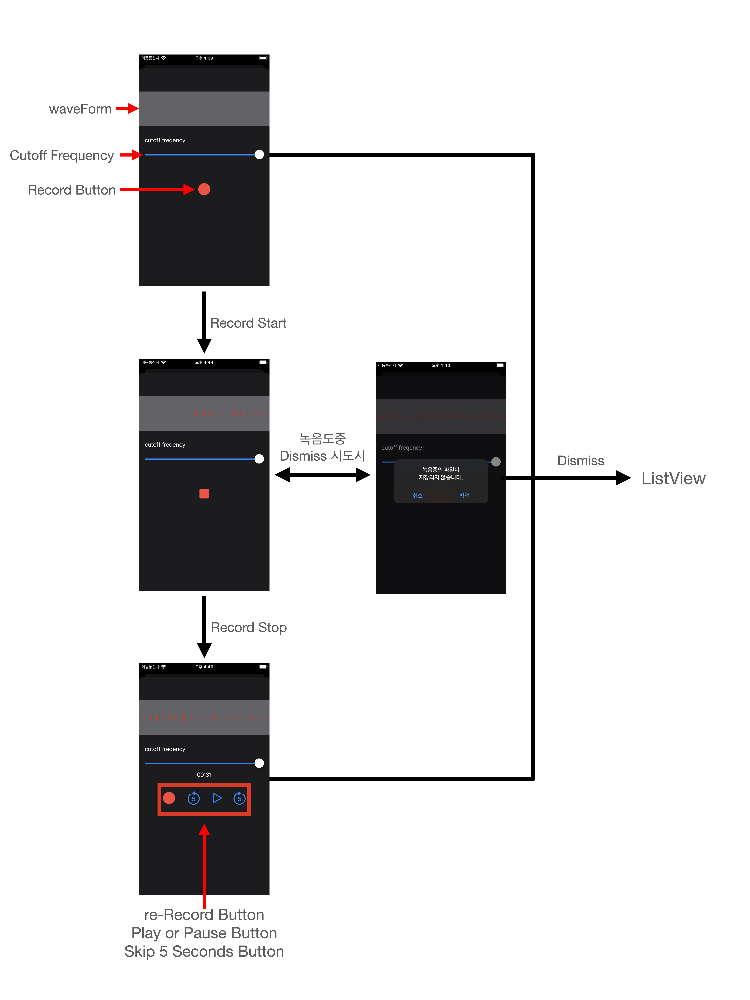  
  

  - PlayView Flow
    

  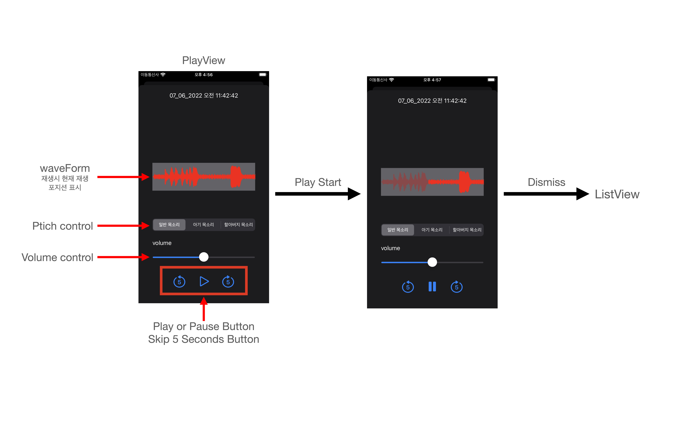

  
### Demo Gif
  - 첫 화면
  
   

  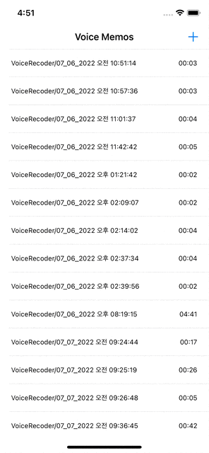

  - RecordView, 레코드 기능
  
   

  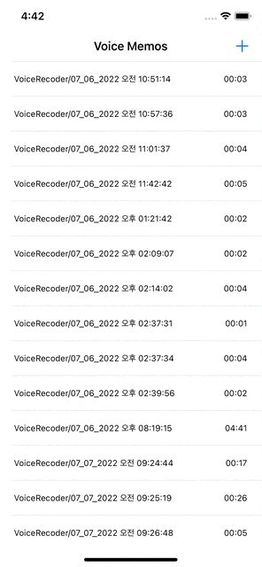

  - RecordView, 재생 기능
  
   

  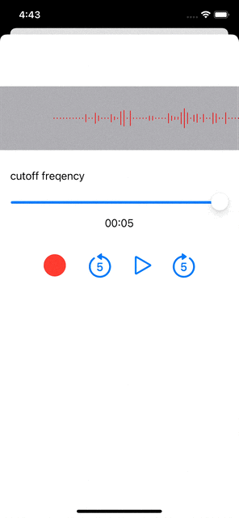

  - PlayView, 재생기능
  
   

  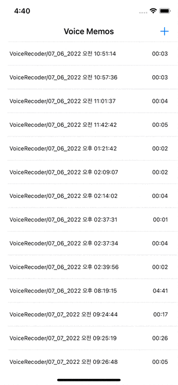

## 사용한 Pattern 소개
### Coordinator Pattern

  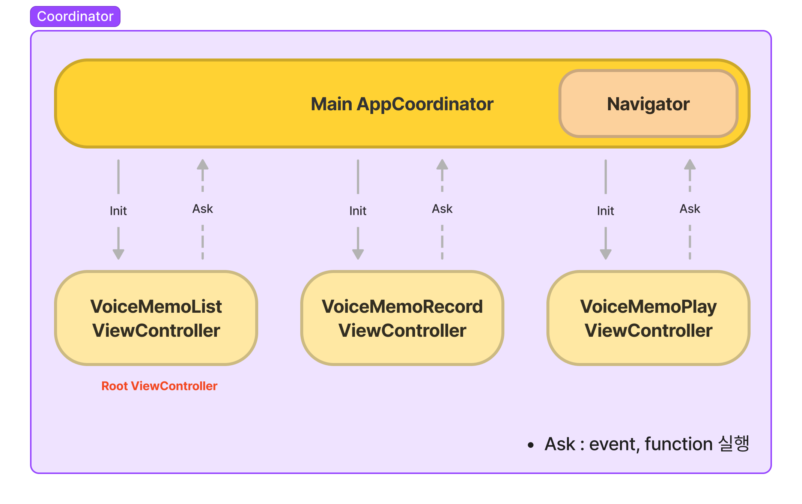
  

### 1. 코디네이터 패턴을 사용한 이유
> MVC에 Coordinator패턴을 적용함으로 Massive VC를 덜어내기 위해 사용하였습니다.

### 2. 어떤 장점이 존재할까?
> Coordinator가 화면 전환 역할을 해주는 객체가 되어 좀 더 VC를 가볍게 만들 수 있습니다. 화면 전환에 대한 코드가 모여 있어 파악, 관리하기가 용이하고 게다가 책임과 구분(역할)에 따라 여러 개의 Coordinator를 사용할 수 있어 객체지향적으로 구현하기 더 수훨합니다.

### Observer Pattern

  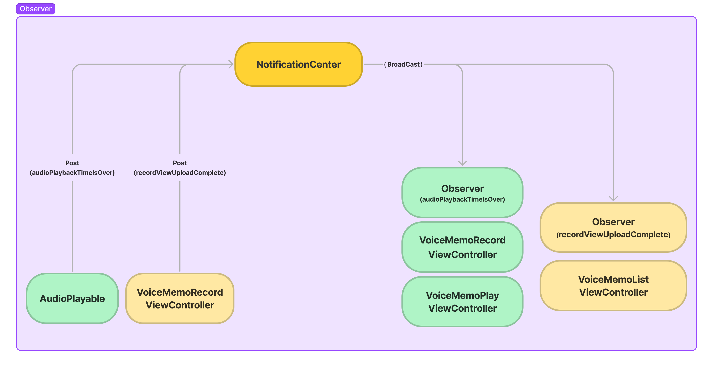
  

### 1. 옵저버 패턴을 사용한 이유
> 옵저버 패턴을 활용하면 변경사항이 생겨도 무난히 처리할 수 있는 유연한 객체 지향 시스템을 구축할 수 있기 때문입니다. 이는 객체 사이의 상호 의존성을 최소화할 수 있기 때문입니다.(느슨하게 결합되어 있기 때문)

### 2. 어떤 장점이 존재할까?
> - Delegate Design Pattern 은 1:1 관계에서 사용하는 반면, Observer & Notification Pattern 은 1:다 관계 성립 가능
( ex. 저희의 경우 레코드뷰, 플레이뷰 2곳에 옵저버를 생성해 AudioPlayable 객체에 1개의 Notification 을 기다릴 수 있게 하였습니다)
> - 실시간으로 한 객체의 변경사항을 다른 객체에 전파할 수 있습니다.
> - 느슨한 결합(Loose Coupling)으로 시스템이 유연하고 객체간의 의존성을 제거할 수 있습니다
> - Open / Close 원칙(개방 폐쇄 원칙)을 지킬 수 있습니다. (개방 폐쇄 원칙: 확장에는 열려있고, 변경에는 닫혀있어야 한다.)

### Delegate Pattern

  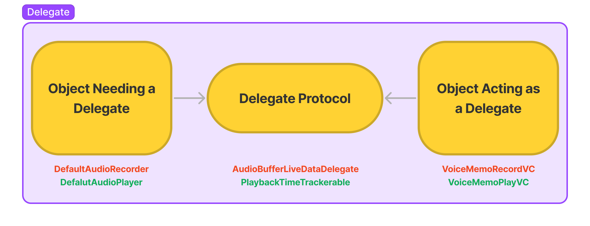
  

### 1. 딜리게이트 패턴을 사용한 이유
> - Delegate을 사용하여 설계하지 않고 Notification만 가지고 설계를 한다면 다른 사람이 코드를 유지보수할 때 이 Notification을 누가 Subscribe하고 있는지 알기가 어렵기 때문에 1:1 관계라면 Delegate을 사용하여 해당 Delegate의 이름, 프로토콜의 메서드 등을 통해 어떤 과정에 의해 이벤트 처리 로직이 돌아가는지 파악하고 추적하기가 한결 수월하기에 Delegate 패턴을 사용하는 것이 좋다고 생각했습니다.

### 2. 어떤 장점이 존재할까?
> - 매우 엄격한 Syntax로 인해 프로토콜에 필요한 메소드들이 명확하게 명시됨.
> - 컴파일 시 경고나 에러가 떠서 프로토콜의 구현되지 않은 메소드를 알려줌.
> - 로직의 흐름을 따라가기 쉬움.
> - 프로토콜 메소드로 알려주는 것뿐만이 아니라 정보를 받을 수 있음.
> - 커뮤니케이션 과정을 유지하고 모니터링하는 제 3의 객체(ex: NotificationCenter 같은 외부 객체)가 필요없음.
> - 프로토콜이 컨트롤러의 범위 안에서 정의됨.

## 객체 역할 소개

### View 관련

| class / struct               | 역할                                                         |
| ---------------------------- | ------------------------------------------------------------ |
| `SceneDelegate`         | - 앱의 초기 권한 요청, Coordinator 및 비즈니스 로직 객체를 생성함.  |
| `AppCoordinator`      | - 앱의 화면 전환을 담당하는 객체. SceneDelegate로 부터 전달받은 객체를 각 ViewController의 필요에 맞게 전달한다.   |
| `VoiceMemoListView`           | - FirebaseStorageManager를 이용하여 사용자의 녹음 파일 목록을 가져온다. - 파일명에 따른 metaData를 얻어와 View에 표기한다.  - 셀을 슬라이드하여, 로컬과 FirebaseStorage내의 녹음 파일을 삭제 할 수 있다. |
| `VoiceMemoRecordView`             | - 녹음을 할 수 있다. - 녹음 시 특정 주파수 이하만 통과 할 수 있도록 한다. - 녹음 시 볼륨 파형을 볼 수 있다.  - 녹음을 재생 할 수 있으며, 재생 위치를 5초 전후로 이동 할 수 있다. - 녹음 완료 시, 녹음 파일을 FirebaseStorage에 업로드한다. |
| `VoiceMemoPlayView` | - 녹음을 재생 할 수 있으며, 재생 위치를 5초 전후로 이동 할 수 있다. - 녹음의 pitch를 바꿔 목소리를 변조 할 수 있다.  - 재생 위치를 View의 색 변화를 통해 알 수 있다.  - 녹음 파일의 볼륨 파형을 볼 수 있다. - 슬라이더를 사용하여 볼륨을 조절 할 수 있다. |
| `WaveFormView`       | - 전달받은 볼륨 파형 Data를 사용하여 User가 볼륨 파형을 쉽게 알 수 있도록 한다. |

### Manger 관련

| class / struct               | 역할                                                         |
| ---------------------------- | ------------------------------------------------------------ |
| `FirebaseStorageManager`         | - FirebaseStorage와 Networking 하는 객체. - 파일 목록 가져오기, 파일의 metaData가져오기, 파일의 다운, 업로드, 삭제 기능    |
| `PathFinder`      | - Class FileManager를 감싼 객체. - 앱에서 필요한 Local File System에 접근하는 기능을 제공.  - 현재 시간을 파일 경로로 제공하는 기능 제공  |
| `AudioManager`           | - Protocol AudioRecordable과 AudioPlayable 채택시, 상속해야 하는 Class.  -두 Procotol의 구현 class에 필요한 공통 Property, Method를 제공한다.  |
| `AudioRecodable`             | - 녹음 기능을 제공하는 Recorder의 기능을 명시하는 Protocol |
| `DefalutAudioRecoder`             | - AudioRecodable을 채택한 Recoder기능을 View에 제공하는 Class |
| `AudioPlayable`             | - 녹음 파일을 재생하는 Player의 기능을 명시하는 Protocol  |
| `DefalutAudioPlayer` | - AudioPlayable을 채택한 Player기능을 View에 제공하는 Class |

## Project UML

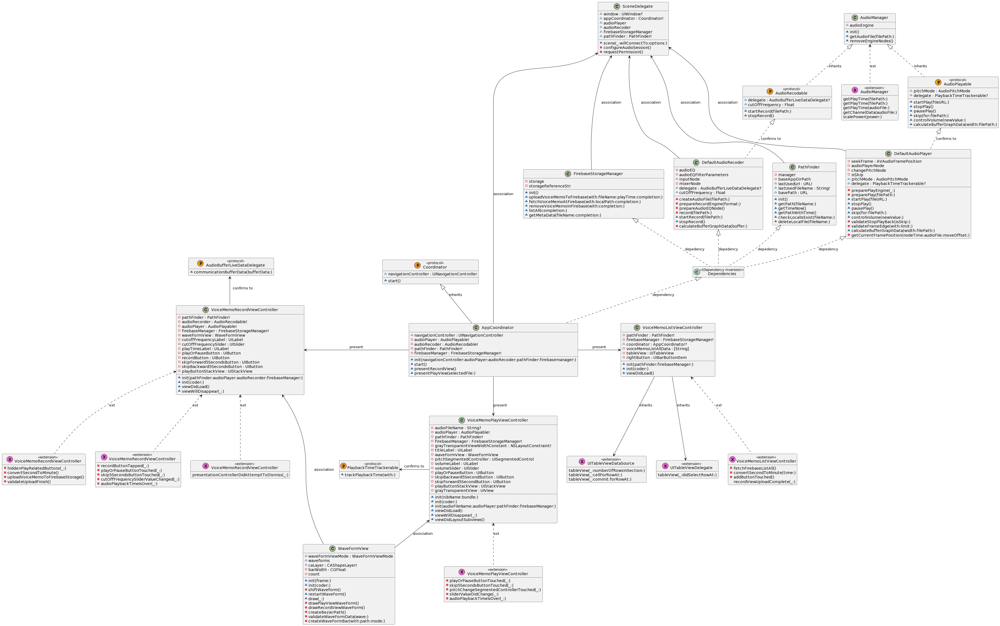

# 고민한 부분

### 순수함수 : 
해당 프로젝트에서는 Manager 폴더 내의 있는 class들이 로직을 담당했습니다.
각 class는 순수함수에 가깝게 구현하려 노력하였습니다.
이 때, 가장 어려웠던 class는 책임을 분리하기 전의 AudioManager였습니다. 이 때에는, 오디오 파일의 local fileSystem 경로인 filePath: URL를 Property로 갖고있는 형태이며, filePath는 init에서 할당하였습니다. 이는 당초 class를 순수함수에 가깝게 구현하려는 방식에 정면으로 부딪히는 방향이었고, 각 method는 filePath를 매개변수로 갖게 되었습니다.
하지만, filePath를 꼭, property로 갖고 있으면 안되는가에 대해서 구현 후에도 몇번이고 다시 고민했던 점은, class 내부에서 method를 사용 할 때에도 filePath를 전달해야 하는 점이 불편했기 때문이었습니다.
이는, 앞으로도 계속해서 고민해야하는 trade-off 라고 생각합니다.

### AudioManager의 분리 : 
AudioManager는 본래 Play, Record와 관련된 모든 기능을 망라하는 class였습니다.
너무 많은 책임을 갖는 class 이므로 Play기능과 Record 기능을 나누었으나, 공통으로 사용하는 Property와 method가 존재하였습니다. 때문에, 실제 play, record의 기능을 하는 class는 공통된 method를 갖고있는 AudioManager를 상속하고, 각각의 기능만 수행하도록 구현하였습니다.
이를 통하여, 각 class가 단일 책임을 갖도록 하였습니다.

### Protocol 채택 :
Protocol AudioPlayable, AudioRecordable을 정의하였습니다. 이를 통하여, 객체 간 결합을 느슨하게하며, mocking test를 진행함에 있어서도 편리성을 얻을 수 있습니다.

### Dependency Injection의 구현 : 
각 ViewController에서 필요한 로직객체를 최상위 모듈로 볼 수 있는 SceneDelegate에서 생성 한 뒤, struct Dependencies를 매개변수로 하여 전달했습니다. 
이를 통하여, 앱 전반에 사용될 로직객체의 변경을 통합적으로 관리 할 수 있습니다. 
불필요한 interface의 전달을 막기 위해서, Dependencies의 전달은 AppCoordinator에서 멈춥니다. 이는, VoiceMemoPlayView에서 AudioRecordable의 구현체 class를 참조 할 필요가 없으므로, Dependencies의 전달을 의도적으로 하지 않은 것입니다. 

### 녹음 파일의 종료 신호 :
AVAudioPlayerNode.scheduleFile, .scheduleSegment method는 trailing Closure를 전달하면, 파일의 종료시 해당 method가 실행됩니다. 때문에, skip method를 실행하며 scheduleFile의 trailing Closure가 실행되어 bug가 발생했었습니다.
때문에, trailing Closure를 사용하지 않고, playerNode.installTab에서 현재 재생중인 Frame과 전체 Frame의 비율인 ratio를 검사하고, 스킵기능에 의한 것인지 확인하여 녹음 파일의 종료신호를 보냅니다.
이를 통하여 두 부분에서 파일 재생 정지에 관한 내용을 명시하지 않고, 한 곳에서 관리 가능해졌습니다.

### 리스트 뷰의 셀 삭제에 대한 고민 :
현재 App은 FirebaseStorage의 파일 목록을 cell로 보여주고 있습니다.
때문에, 네트워크의 success 리스폰스를 받았을 때, local의 파일을 삭제하는 것은 dummy data를 남길 위험을 내포한다 생각하였습니다. 그러므로 삭제 기능이 작동하면, local fileSystem에 해당 녹음파일의 존재 여부를 확인하고, 존재한다면 삭제합니다. 그 후 firebaseStorage의 파일 remove의 response로 success를 받았을 때, TableView의 Cell을 제거하도록 구현하였습니다.

# 회고

### 전체 회고
이번 프로젝트는 팀원으로 참여하거나, 혼자하던 프로젝트와는 다르게, 팀원을 리드하는 위치에서 프로젝트를 진행하였다. 
내게 주어진 일만 잘 하거나, 특별한 일정없이 혼자 진행했던 프로젝트와는 달랐다. 
팀원의 진행 사항, 수행 능력, 학습 속도에 따라서, 업무를 나누고 프로젝트의 일정을 관리하는 일은 쉽지 않았다. 때문에, 21시를 넘어서도, 어떻게 해야할까 고민하고, 할 일을 적으며 늦게까지 시간을 보내 에너지를 너무 많이 썼다는 생각이 들었다. 가능하다면, 이와같은 계획도, 프로젝트를 진행하는 시간에 해야하며, 충분한 휴식을 취해야 지속 할 수 있다는 생각이 들었다.

초기 프로젝트의 계획에서는, 기능을 구현한 뒤, MVVM으로 전환을 목표로 하였다. 이 때, 리스크를 줄이기 위해서 MVC로 완전한 구현을 마친뒤에, 충분한 일정이 확보 된다면 진행하기로 계획했기 때문에 계획의 변경이 유연하게 진행 될 수 있었던 것 같다. 프로젝트를 진행하거나, 어떠한 일을 진행 할 때, 이와 같이 착지점을 확보하는 것이 중요하다는 것을 다시 한 번 깨달았다.

프로젝트를 완료하고 나서, 테스트 및 에러처리에 대한 부분이 아쉽다는 생각이 들었다. 
권한 요청을 거부하면 어떻게 할 것인지, 이러한 내용에 대한 계획이 전혀 없었던 점이, 개발된 프로젝트의 완성도가 낮아보이게 하는 점이라는 생각이 들었다. 실패에 대한 내용을 사용자에게 알리는 것 또한 HIG를 준수하는 것으로, 추후에는 이와 같은 내용을 잊지말고 고려할 것이다.
테스트 측면도 아쉽다. 로컬에 파일이 존재하는지 확인하는 기능을 구현할 때, 테스트 코드를 작성하지않아, 어디까지는 문제가 없는지 확신 할 수 없었다. 때문에 원인을 찾기 어려웠고, 디버깅 시간도 길었다. 추후에는 모든 테스트 코드를 작성하지는 않더라도, 기본적인 내용에 대한 코드라도 작성해야겠다는 생각이 들었다.

프로젝트를 하며, 처음보는 것을 공부하고, 이해하기 어려운 버그를 해결하며, 팀원에게 새로운 패턴이나 기법을 소개하고 정보를 나누던 시간과, 팀의 계획 등을 설명하고, 이를 수행하는 과정은 충분히 즐겁고 보람찬 시간이었다. 팀원들 모두에게 고생했고, 같이 프로젝트를 진행해서 즐거웠다는 얘기를 전하고싶다.

### git 관련 회고
나는 gitDesktop을 사용한다. 약간 사파같은 느낌인데, 그래도 git의 사용법을 알고 쓰니까 괜찮다고 생각했다. 하지만, GUI를 쓰기에 명령어를 잘 모르는 나는, 터미널만을 이용하여 진행하는 팀원에게 새로운 branch를 checkout, pull 한 뒤, 수정사항을 commit, push하는 과정을 알려주는 것은 쉽지 않았다. 터미널을 꼭 사용하지 않더라도, 가끔 명령어를 슥 한번 읽는 루틴이 필요한 것 같다.

### 기술 관련 회고
1. 이번 프로젝트는 앱의 기능이 복잡하거나 하지 않아서, MVC로 구현했다고 생각했다. 하지만, 정신없이 프로젝트를 완료한 뒤, 결과물을 보니, Model이 없단 것을 깨달았다. 그렇다, View와 Controller만 있는 것이다.   

Model객체는 로직을 담고 있을 수도 있지만, 보통 정보를 담고 있다고 생각한다. 로직이 좀 크지만, 오디오를 재생, 녹화하는 DefaultAudioRecorder, Player를 모델로 볼 수 있지 않을까? 라고 생각도 해봤지만, 두 class는 audioEngine의 설정과 기능에 대한 내용을 갖고 있으며, 녹음 파일의 data를 저장하지 않는다. 때문에, Model로 볼 수 없다고 생각했다.  

물론 architecture에 꼭 집착하지 않아도 된다. 하지만 audioFile이라는 model을 토대로 앱을 설계했다면 어떨까? 하는 아쉬움이 있다.  

2. audioFile의 bufferData를 읽어 파형을 그리는 것은 충분히 어려웠다. audioFile에 대한 기본적인 지식 없이 코드를 읽으니, 용어와 수식이 전혀 이해되지 않았다. 이러한 상황에서 필요한 기능을 개발하는 것은 지난하고, 어렵고, 정신적으로 고통스러운 일이었다.  
차후 이와 같은 문제에 봉착했을 때에는, 최대한 기본지식에 대한 스터디를 진행하는 것이 오히려 시간을 단축하고, 더 나은 개발을 하는 것이란 생각이 들었다.  

### 협업 관련 회고
1. 협업의 진행 전, 여러 컨벤션과 명칭에 대한 규칙을 정하고 시작하는 것을 알 고 있었다. 하지만, 소규모 프로젝트니까 괜찮겠지 하는 안일한 마음으로 스리슬쩍 시작했다.  
이 행동은 눈덩이가 굴러 커지듯 불어나, 마지막에 와서 다수의 리팩토링 항목을 만들어주었다. 한 번 일할 것을 두 번 일하게 된 것이다. 추후에는 이와 같은 안일한 행동을 지양해야겠다는 다짐을 했다.  

2. 브랜치 전략이 아쉬웠다. main - dev - featureBranch 로 나누어 진행 한 것은 좋았으나, dev에 merge하는 과정에 대해서 미흡했다. 이로 인하여, 간단히 알 수 있는 오타, 잘못된 로직, 모호한 명칭 등을 사전에 걸러 낼 수 없었다. 물론 dev branch의 역할 자체를 main에 merge하기 전 거름망으로 설정하였으므로, 큰 문제는 아니라고 생각하지만, PR을 통하여 코드리뷰를 진행하는 것도 좋았을 것이라 생각한다.

